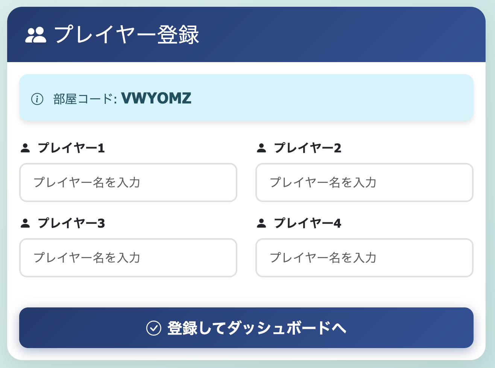
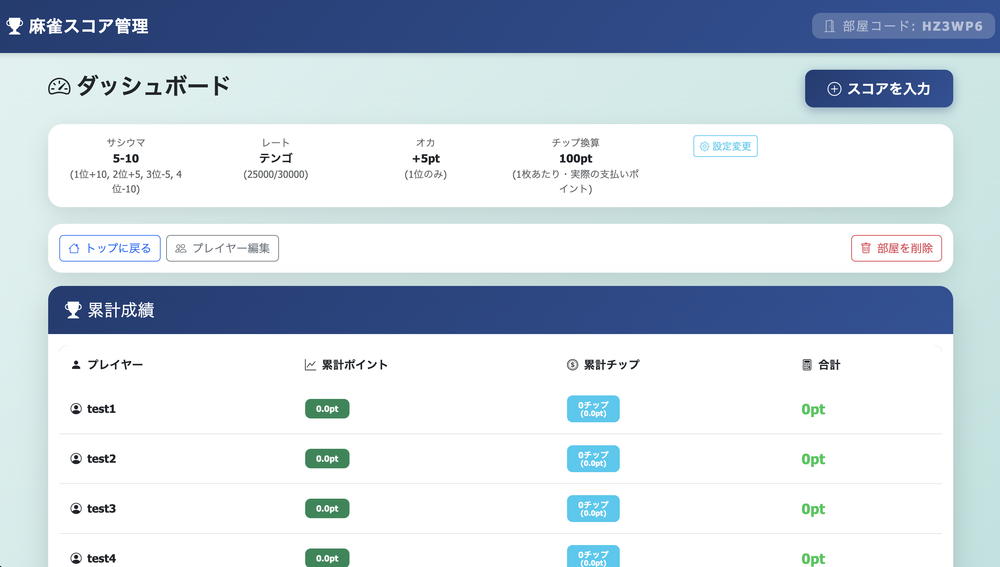
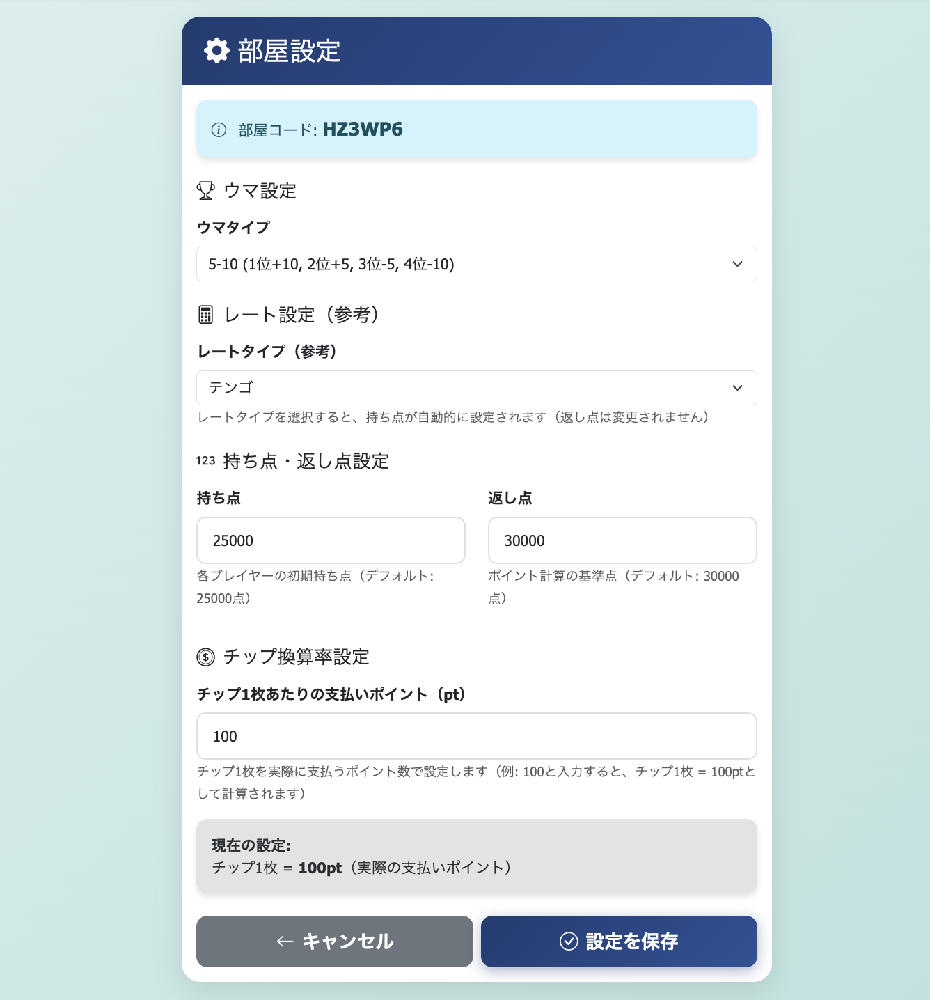
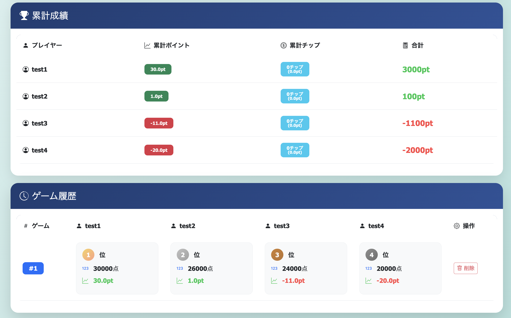

# 麻雀スコア管理アプリ

**複雑な麻雀のスコア計算を自動化し、4人でリアルタイム共有できるWebアプリケーション**

[](https://www.python.org/)
[](https://www.djangoproject.com/)

---

## デモサイト

**[https://mahjong-app-8v1l.onrender.com/](https://mahjong-app-8v1l.onrender.com/)**

実際に使用できるデプロイ済みのWebアプリケーションです。ぜひお試しください！

**注意**: Renderの無料プランを使用しているため、一定時間アクセスがない場合、自動的に停止されます。初回アクセス時は起動に時間がかかります。

---

## アプリケーション概要

麻雀の半荘ごとのスコアとチップを記録・共有するWebアプリケーションです。4人で行う麻雀の対戦結果をリアルタイムで共有し、複雑なスコア計算を自動化することで、正確な収支管理を実現します。

### 解決する課題

- **手動でのスコア計算ミス** → 自動計算で正確な収支管理
- **複数人でのスコア共有の煩雑さ** → リアルタイム共有機能
- **複雑な麻雀ルール（ウマ・オカ・チップ）の計算負担** → 自動計算機能
- **デバイスを問わずアクセスできる環境の必要性** → レスポンシブデザイン

### ターゲットユーザー

- 定期的に麻雀を行う4人グループ
- 正確な収支管理を重視するプレイヤー
- スマートフォンやタブレットからもアクセスしたいユーザー

---

## 開発した背景

麻雀をプレイする際、手動でスコアを計算すると計算ミスが発生しやすく、特に複雑なルール（ウマ・オカ・チップ換算）を考慮すると、正確な計算が困難でした。また、複数人でスコアを共有する際も、紙やメモアプリを使うと煩雑で、リアルタイムで最新情報を共有することができませんでした。

この課題を解決するため、以下の機能を実装したWebアプリケーションを開発しました：

- **自動計算機能**: ウマ・オカ・チップ換算を考慮したポイントを自動計算
- **リアルタイム共有**: HTMXによる非同期通信で3分ごとに自動更新
- **柔軟な設定**: 9種類のレート設定とカスタムサシウマ設定に対応
- **レスポンシブデザイン**: スマートフォンやタブレットでも快適に使用可能

DjangoのMVT設計、データベース連携、トランザクション管理、HTMXによる非同期通信といったWebアプリケーション開発の実践的なスキルを習得することを目的として開発しました。

---

## 主な機能

| 機能 | 説明 |
| --- | --- |
| **部屋作成・共有** | 6桁の英数字コードで部屋を作成し、複数人で共有 |
| **プレイヤー管理** | 4名のプレイヤーを登録・管理 |
| **スコア記録** | 持ち点とチップ増減を記録 |
| **自動計算** | ウマ・オカ・チップ換算を考慮したポイントを自動計算 |
| **リアルタイム更新** | HTMXによる非同期通信で3分ごとに自動更新 |
| **柔軟な設定** | 9種類のレート設定とカスタムサシウマ設定に対応 |
| **統計表示** | ゲーム履歴と累計成績を自動集計・表示 |

---

## 画面と機能の詳細

| トップページ | プレイヤー登録ページ |
| --- | --- |
|  |  |
| 6桁の英数字コードで部屋を作成し、複数人で共有できます。シンプルなデザインで、すぐに使い始められるよう工夫しました。 | 4名のプレイヤーを登録できます。各プレイヤーの名前を入力し、順番を設定します。 |

| ダッシュボード | スコア記録ページ |
| --- | --- |
|  |  |
| ゲーム履歴と累計成績を表示します。HTMXによる非同期通信で3分ごとに自動更新され、最新情報がリアルタイムで反映されます。各プレイヤーの累計ポイントや順位を一目で確認できます。 | 各プレイヤーの持ち点とチップ増減を入力します。入力値のバリデーション機能により、不正な値の入力を防ぎます。ウマ・オカ・チップ換算を考慮したポイントが自動計算されます。 |

| 部屋設定ページ | ゲーム履歴一覧 |
| --- | --- |
|  |  |
| 部屋の設定を変更できます。レート設定（9種類）やサシウマ設定（5-10、10-20、10-30、カスタム）を選択できます。持ち点や返し点、チップ換算率も設定可能です。 | 過去のゲーム履歴を一覧で表示します。各ゲームの結果やポイントを確認でき、HTMXによる自動更新で最新の情報が表示されます。 |

---

## 使用技術

### バックエンド
| 技術 | バージョン | 用途 |
| --- | --- | --- |
| **Python** | 3.11 | 最新のPython機能を活用 |
| **Django** | 5.2.4 | MVTアーキテクチャによる保守性の高い設計 |
| **SQLite** | - | 小規模運用に適した軽量データベース |

### フロントエンド
| 技術 | 用途 |
| --- | --- |
| **Django Templates** | サーバーサイドレンダリングによるSEO対応 |
| **Bootstrap 5** | レスポンシブデザインで全デバイス対応 |
| **HTMX** | 軽量な非同期通信ライブラリによるUX向上 |

### インフラ・デプロイ
| 技術 | 用途 |
| --- | --- |
| **Render** | クラウドプラットフォームでデプロイ |
| **Gunicorn** | 本番環境用WSGIサーバー（Workers: 2） |
| **WhiteNoise** | 静的ファイルの効率的な配信 |

---

## ER図

```
Room (部屋)
  ├── code: 6桁の英数字コード（一意）
  ├── rate_type: レート設定
  ├── sashi_uma_type: サシウマタイプ
  ├── starting_points: 持ち点
  ├── return_points: 返し点
  └── chip_point_rate: チップ換算率
      │
      ├── Player (プレイヤー) [1:N]
      │   ├── name: プレイヤー名
      │   └── order: 順番 (1-4)
      │       │
      │       └── ScoreRecord (スコア記録) [1:N]
      │           ├── score: 持ち点
      │           ├── chip_change: チップ増減
      │           ├── rank: 順位
      │           └── points: 計算されたポイント
      │
      └── Game (半荘) [1:N]
          ├── game_number: ゲーム番号
          └── ScoreRecord (スコア記録) [1:N]
```

### データモデルの特徴

- **正規化されたデータ構造**: 4つのエンティティに分離し、データの重複を排除
- **整合性の保証**: 外部キー制約により、不正なデータの作成を防止
- **拡張性の確保**: 新しい機能を追加する際も既存の構造を壊さない

---

## インフラ構成図

```
┌─────────────────┐
│   Render/Fly.io │ (クラウドプラットフォーム)
│                 │
│  ┌───────────┐  │
│  │ Gunicorn  │  │ (WSGIサーバー)
│  │ Workers: 2 │  │
│  └─────┬─────┘  │
│        │        │
│  ┌─────▼─────┐  │
│  │  Django   │  │ (アプリケーション)
│  │   5.2.4   │  │
│  └─────┬─────┘  │
│        │        │
│  ┌─────▼─────┐  │
│  │  SQLite   │  │ (データベース)
│  │ db.sqlite3│  │
│  └───────────┘  │
│                 │
│  ┌───────────┐  │
│  │ WhiteNoise│  │ (静的ファイル配信)
│  └───────────┘  │
└─────────────────┘
        ▲
        │ HTTP/HTTPS
        │
┌───────┴───────┐
│   Client      │ (ブラウザ)
│   (HTMX)      │
└───────────────┘
```

### アーキテクチャの特徴

- **サーバーサイドレンダリング**: Django Templatesによる完全なSSR
- **軽量な非同期通信**: HTMXによる部分更新
- **シンプルな構成**: 追加のキャッシュサーバーやメッセージキューは不要

---

## 実装のハイライト

### 1. 保守性を重視したアーキテクチャ設計

**問題**: 麻雀のスコア計算は複雑で、ルール変更に対応しやすい設計が必要

**解決策**:
- データモデルを4つのエンティティ（Room, Player, Game, ScoreRecord）に分離
- ビジネスロジックをモデルのプロパティメソッドに集約
- ビュー関数をシンプルに保ち、責務を明確に分離

```python
# 例: サシウマからウマを自動計算するプロパティ
@property
def uma_1st(self):
    """1位ウマ（サシウマから計算）"""
    _, uma_3_4 = self._get_sashi_uma_values()
    return uma_3_4
```

**効果**: ルール変更時もモデルのプロパティを修正するだけで対応可能

### 2. データ整合性の保証

**問題**: スコア記録時に複数のデータを同時に更新する必要がある

**解決策**:
- `transaction.atomic()`デコレータを使用したトランザクション管理
- エラー発生時の自動ロールバック
- 持ち点の合計検証による入力値の妥当性チェック

**効果**: データの不整合を防ぎ、信頼性の高いアプリケーションを実現

### 3. 複雑なスコア計算ロジックの自動化

麻雀のスコア計算は以下の要素を含みます：
- **素点**: 持ち点から返し点を引いた値
- **ウマ**: 順位に応じたポイント（サシウマ設定から自動計算）
- **オカ**: 返し点と持ち点の差から計算
- **チップ**: チップ増減をポイントに換算

これらを自動計算するロジックを実装し、ユーザーは持ち点とチップ増減を入力するだけで正確な収支が計算されます。

### 4. UXを意識した非同期通信

**問題**: 複数人で同時に使用する際、最新情報をリアルタイムで共有したい

**解決策**:
- HTMXによる軽量な非同期通信を実装
- 3分ごとの自動更新でページリロード不要
- パーシャルテンプレートによる部分更新

**効果**: ページリロードなしで最新情報を表示し、ユーザー体験を向上

### 5. レスポンシブデザイン

Bootstrap 5を使用し、デスクトップ・タブレット・スマートフォンすべてで快適に使用できるUIを実現。麻雀は長時間のゲームのため、どのデバイスからでもアクセスできることが重要です。

---

## 技術選定の理由

| 技術 | 選定理由 |
| --- | --- |
| **Django** | MVTアーキテクチャによる責務の分離が明確で保守性が高い。ORMによる安全なデータベース操作とマイグレーション管理が容易。認証、セッション管理、CSRF保護などが標準装備。 |
| **HTMX** | 軽量でフレームワーク不要。既存のHTMLに属性を追加するだけで非同期通信を実現。ReactやVue.jsのような複雑な状態管理が不要。サーバーサイドレンダリングとの相性が良い。 |
| **SQLite** | 小規模運用に適しており、追加のデータベースサーバーが不要。設定が不要で、開発から本番まで同じデータベースを使用可能。読み取り中心のアプリケーションでは十分な性能を発揮。 |

---

## 今後の展望

### 追加したい機能

- **認証機能**: ユーザー登録・ログイン機能の追加により、個人の成績を管理できるようにする
- **API**: RESTful APIの提供により、モバイルアプリ対応を実現
- **リアルタイム通信**: WebSocketによるより高速な更新（現在は3分ごとの更新）
- **統計機能**: より詳細な統計分析機能の追加（勝率、平均順位、最高スコアなど）

### 将来的な改善予定

- **データベース**: ユーザー数増加時のPostgreSQLへの移行を検討
- **パフォーマンス**: クエリ最適化（`select_related()`、`prefetch_related()`の活用）
- **テストカバレッジ**: より包括的なテストの追加
- **エラーハンドリング**: より詳細なエラーログとモニタリングの実装

---

## プロジェクト構造

```
mahjong_app/
├── mahjong/                    # メインアプリケーション
│   ├── models.py              # データモデル（ビジネスロジック含む）
│   ├── views.py               # ビュー関数
│   ├── urls.py                # URLルーティング
│   ├── templates/             # HTMLテンプレート
│   │   └── mahjong/
│   │       ├── base.html
│   │       ├── index.html
│   │       ├── dashboard.html
│   │       └── partials/      # HTMX用パーシャルテンプレート
│   ├── templatetags/          # カスタムテンプレートタグ
│   └── management/            # カスタム管理コマンド
│       └── commands/
│           └── cleanup_old_rooms.py
├── mahjong_project/           # Djangoプロジェクト設定
│   ├── settings.py            # 設定ファイル
│   ├── urls.py                # ルートURL設定
│   └── wsgi.py                # WSGI設定
├── requirements.txt           # Python依存関係
├── render.yaml                # Render設定ファイル
└── README.md                  # このファイル
```

---

## 開発環境のセットアップ

このアプリケーションは既にデプロイ済みですが、開発やカスタマイズのためにローカル環境で実行する場合：

### 前提条件

- Python 3.11以上
- pip

### セットアップ手順

```bash
# リポジトリをクローン
git clone https://github.com/[ユーザー名]/mahjong_app.git
cd mahjong_app

# 仮想環境を作成
python -m venv venv
source venv/bin/activate  # Windows: venv\Scripts\activate

# 依存関係をインストール
pip install -r requirements.txt

# 環境変数を設定（.env.exampleを参考）
cp .env.example .env

# データベースマイグレーション
python manage.py migrate

# 開発サーバーを起動
python manage.py runserver
```

ブラウザで `http://127.0.0.1:8000` にアクセス

---

## 関連ドキュメント

- [ポートフォリオ詳細](PORTFOLIO.md) - 開発の背景と工夫点
- [アーキテクチャドキュメント](ARCHITECTURE.md) - 詳細な設計思想と実装

